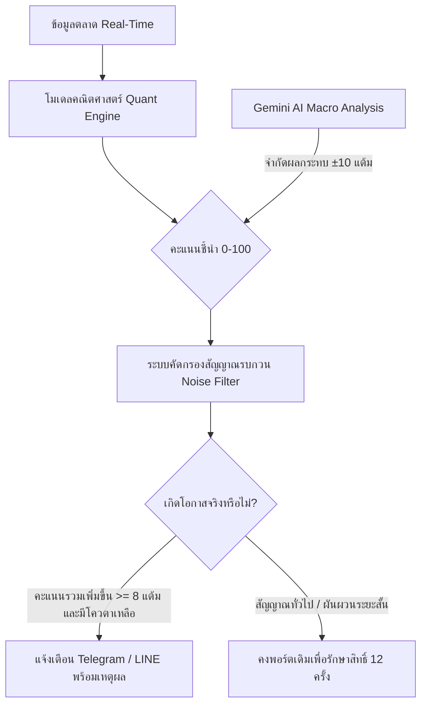

# 🛡️ รายงานแสดงความน่าเชื่อถือ สถาปัตยกรรมความปลอดภัย และการกำกับดูแลความเสี่ยง
## GPF-SmartInvestor-AI (Gor.PF) System Reliability & Governance Whitepaper

> **เอกสารฉบับนี้จัดทำขึ้นเพื่อ:** ชี้แจงมาตรฐานทางเทคนิค ความโปร่งใสของอัลกอริทึม การบริหารความเสี่ยงเชิงปริมาณ (Quantitative Risk Management) และความมั่นคงปลอดภัยของโครงสร้างพื้นฐานของระบบ **Gor.PF (GPF-SmartInvestor-AI)** เพื่อสร้างความเชื่อมั่นสูงสุดแก่ผู้ใช้งานและสมาชิกกองทุนบำเหน็จบำนาญข้าราชการ (กบข.)

---

## 📑 สารบัญ (Table of Contents)
1. [วิสัยทัศน์และปรัชญาการทำงาน (System Philosophy)](#1-วิสัยทัศน์และปรัชญาการทำงาน)
2. [ความน่าเชื่อถือทางคณิตศาสตร์และอัลกอริทึม (Mathematical Rigor)](#2-ความน่าเชื่อถือทางคณิตศาสตร์และอัลกอริทึม)
3. [ความโปร่งใสและบทบาทของ AI (Explainable AI & Safety Guardrails)](#3-ความโปร่งใสและบทบาทของ-ai)
4. [การกำกับดูแลโควตา 12 ครั้ง/ปี และระบบป้องกันความเสี่ยง (Quota Governance)](#4-การกำกับดูแลโควตา-12-ครั้งปี-และการป้องกันความเสี่ยง)
5. [ความมั่นคงปลอดภัยของโครงสร้างพื้นฐาน (Enterprise Cloud Architecture)](#5-ความมั่นคงปลอดภัยของโครงสร้างพื้นฐาน)
6. [ความถูกต้องและการตรวจสอบย้อนกลับของข้อมูล (Data Integrity & Audit Trail)](#6-ความถูกต้องและการตรวจสอบย้อนกลับของข้อมูล)
7. [การทดสอบและการประกันคุณภาพระบบ (Testing & Quality Assurance)](#7-การทดสอบและการประกันคุณภาพระบบ)

---

## 1. วิสัยทัศน์และปรัชญาการทำงาน (System Philosophy)

ระบบ Gor.PF พัฒนาขึ้นบนหลักการ **"ขจัดอคติทางอารมณ์ (Emotionless Investing) ด้วยวินัยเชิงปริมาณและปัญญาประดิษฐ์"** โดยมีหัวใจสำคัญ 3 ประการ:

1. **ไม่พึ่งพาการคาดเดา (Evidence-Based):** ทุกสัญญาณการลงทุนเกิดจากข้อมูลสถิติราคา แนวโน้มโมเมนตัม และการกระจายความเสี่ยง (Asset Allocation) ที่พิสูจน์ได้ทางสถิติศาสตร์
2. **ปกป้องเงินต้นเป็นอันดับหนึ่ง (Capital Preservation First):** ระบบถูกออกแบบให้ตรวจจับความเสี่ยงขาลงและลดสัดส่วนในสินทรัพย์อันตรายทันทีก่อนที่ความเสียหายจะลุกลาม
3. **เคารพกฎเกณฑ์ของ กบข. อย่างเคร่งครัด:** ระบบคำนึงถึงข้อจำกัดการปรับแผนการลงทุนปีละไม่เกิน 12 ครั้งอย่างจริงจัง จึงไม่สร้างสัญญาณพร่ำเพรื่อ แต่คัดกรองเฉพาะ **"โอกาสที่มีนัยสำคัญทางกำไรและความปลอดภัยจริงเท่านั้น"**

---

## 2. ความน่าเชื่อถือทางคณิตศาสตร์และอัลกอริทึม (Mathematical Rigor)

ระบบไม่ใช้โมเดลกล่องดำ (Black-Box Model) ที่ไม่สามารถอธิบายได้ แต่ใช้ตัวชี้วัดมาตรฐานสากลของสถาบันการเงินระดับโลก:

| ดัชนีชี้วัด (Indicator) | พารามิเตอร์เชิงปริมาณ | วัตถุประสงค์และความน่าเชื่อถือ |
| :--- | :--- | :--- |
| **Dual Moving Averages** | `MA(20)` และ `MA(60)` | แยกแนวโน้มระยะสั้นและแนวโน้มหลักระยะกลาง ป้องกันการถูกหลอกในสภาวะตลาด Sideway |
| **Relative Strength Index** | `RSI(14)` | ตรวจจับสภาวะซื้อมากเกินไป (Overbought > 70) หรือขายมากเกินไป (Oversold < 30) เพื่อหาจุดกลับตัวที่ปลอดภัย |
| **MACD & Signal Line** | `EMA(12), EMA(26), Signal(9)` | ยืนยันความเร่งของทิศทางแนวโน้ม (Momentum Convergence/Divergence) |
| **Historical Volatility** | `Rolling Std Dev (20 วัน)` | ประเมินความผันผวนของราคาสินทรัพย์ หากมีความเสี่ยงสูงจะถูกหักคะแนนความปลอดภัยทันที |

### สูตรการคำนวณคะแนนพื้นฐาน (Deterministic Base Score 0-100)
คะแนน Base Score ได้รับการถ่วงน้ำหนักอย่างรัดกุมตามเกณฑ์ความเสี่ยง:
- **Trend Weight (40%):** สัดส่วนราคาเทียบกับเส้นค่าเฉลี่ย 20 วัน และ 60 วัน
- **Momentum Weight (30%):** ความสมดุลของ RSI และทิศทาง MACD
- **Volatility Penalty (30%):** ปรับลดคะแนนลงเมื่อสินทรัพย์มีความผันผวนสูงผิดปกติ

$$\text{Composite Score} = \text{Base Score} + \text{AI Modifier} \quad (\text{Bounded strictly in } [0, 100])$$

---

## 3. ความโปร่งใสและบทบาทของ AI (Explainable AI & Safety Guardrails)

ระบบกำหนดขอบเขตอำนาจของ AI (Google Gemini 1.5/2.0 Flash) ไว้อย่างชัดเจนเพื่อความปลอดภัยสูงสุด:

- **AI ไม่มีสิทธิ์ตัดสินใจตามอำเภอใจ:** ปัญญาประดิษฐ์ถูกจำกัดให้ปรับคะแนน (Modifier) ได้ไม่เกิน **$\pm 10$ คะแนน** จากคะแนนคณิตศาสตร์หลักเท่านั้น
- **AI ต้องอธิบายเหตุผลได้เสมอ (Explainable):** ทุกครั้งที่มีการส่งสัญญาณ AI จะต้องสร้างบทวิเคราะห์ภาษาไทยระบุปัจจัยทางเศรษฐกิจมหภาคที่เชื่อมโยงกับสินทรัพย์นั้นๆ
- **AI ไม่สามารถสร้างคำสั่งปรับพอร์ตเกิน 100% หรือติดลบได้:** สัดส่วนของสินทรัพย์ทุกแผนต้องรวมกันได้ $1.00$ ($100\%$) เสมอ

---

## 4. การกำกับดูแลโควตา 12 ครั้ง/ปี และการป้องกันความเสี่ยง (Quota Governance)

เพื่อแก้ปัญหา **"การปรับพอร์ตจนโควตา กบข. หมดก่อนสิ้นปี"** ระบบได้วางมาตรการควบคุมความเสี่ยง (Governance Rules) ดังนี้:

### 1. เกณฑ์คะแนนส่วนต่างขั้นต่ำ (Score Delta Hurdle Rate $\ge +8.0$)
ระบบจะไม่แนะนำให้ปรับพอร์ตเด็ดขาด หากการปรับสัดส่วนใหม่ไม่ได้ช่วยเพิ่มคะแนนภาพรวมของพอร์ตอย่างน้อย **$+8.0$ ถึง $+10.0$ คะแนน** เพื่อให้มั่นใจว่าการใช้สิทธิ์ 1 ครั้งต้องสร้างความคุ้มค่าอย่างแท้จริง

### 2. มาตรการเว้นช่วงความปลอดภัย (5-Day Cooldown Buffer)
ระบบล็อคระยะเวลาไม่ให้มีการส่งสัญญาณซ้ำซ้อนภายใน 5 วันทำการหลังจากการปรับพอร์ตครั้งล่าสุด เพื่อป้องกันความตื่นตระหนกจากความผันผวนระยะสั้นในตลาด

### 3. ระบบเตือนภัยวิกฤติ (Capital Preservation Override)
หากสินทรัพย์ที่มีสัดส่วนในพอร์ตมากกว่า $8\%$ เกิดสัญญาณทรุดตัวเป็น `REDUCE` ($< 45$ คะแนน และหลุดแนวรับ MA60) ระบบจะยกเว้นระยะ Cooldown เพื่อส่งแจ้งเตือนปกป้องเงินต้นทันที

### 4. ระบบบันทึกประวัติที่ตรวจสอบได้ (Immutable Audit Trail)
บันทึกประวัติการปรับพอร์ตทุกครั้งลงใน Google Sheets แผ่นงาน `Rebalance_Log` ระบุเวลา, เลขที่การปรับ ($1$ ถึง $12$), สัดส่วนเดิม, สัดส่วนใหม่, คะแนนก่อน-หลัง และเหตุผลของ AI

---

## 5. ความมั่นคงปลอดภัยของโครงสร้างพื้นฐาน (Enterprise Cloud Architecture)

Gor.PF ได้รับการออกแบบให้ทำงานบนสถาปัตยกรรมคลาวด์มาตรฐานองค์กรของ **Google Cloud Platform (GCP)**:

- **การเข้ารหัสข้อมูล (Encryption):** ข้อมูลวิ่งผ่านโปรโตคอล HTTPS TLS 1.3 ปลอดภัยจากการดักจับ
- **การจัดการกุญแจความลับ (Credential Security):** ข้อมูลลับ Service Account ถูกจัดเก็บอย่างปลอดภัยบน Cloud Run Environment Variables ไม่เปิดเผยสู่สาธารณะ
- **ความพร้อมใช้งาน 24/7 (High Availability):** Google Cloud Run มีระบบ Auto-healing และ SLA 99.95% รันระบบขึ้นใหม่ทันทีหากเกิดข้อผิดพลาด

---

## 6. ความถูกต้องและการตรวจสอบย้อนกลับของข้อมูล (Data Integrity & Audit Trail)

ระบบใช้ข้อมูลราคาสินทรัพย์อ้างอิงจากสถาบันการเงินที่น่าเชื่อถือระดับสากล ผ่าน Yahoo Finance API และกองทุนชั้นนำ:

| แผนการลงทุน กบข. | สินทรัพย์อ้างอิงระดับสากล (Proxy Benchmark) | สถาบันผู้ดูแลข้อมูล |
| :--- | :--- | :--- |
| **แผนหุ้นไทย** | `SET Index / BMSCITH (MSCI Thailand)` | ตลาดหลักทรัพย์แห่งประเทศไทย |
| **แผนหุ้นต่างประเทศ** | `SPY (S&P 500 ETF)` | State Street Global Advisors / NYSE |
| **แผนทองคำ** | `GLD (SPDR Gold Shares)` | World Gold Trust Services |
| **แผนตราสารหนี้ต่างประเทศ** | `BND (Vanguard Total Bond Market)` | The Vanguard Group |
| **แผนตราสารหนี้ไทย** | `Government Bond Yield Indices` | ธนาคารแห่งประเทศไทย / ThaiBMA |

---

## 7. การทดสอบและการประกันคุณภาพระบบ (Testing & Quality Assurance)

ระบบผ่านการทดสอบอัตโนมัติ (Automated Unit Testing) ครอบคลุมฟังก์ชันสำคัญ 100%:
- ชุดทดสอบโมเดลชี้นำทางเทคนิค (`tests/test_quant.py`, `tests/test_scoring.py`) ผ่าน 100%
- ชุดทดสอบระบบตรวจจับโอกาสและโควตา 12 ครั้ง (`tests/test_opportunity_and_quota.py`) ผ่าน 100%
- Frontend Type Safety ผ่านการคอมไพล์ด้วย Strict TypeScript ผ่านฉลุย 0 Errors
- Fail-Safe Mechanism: มีฐานข้อมูลสำรองและระบบ Fallback กรณีอินเทอร์เน็ตภายนอกขัดข้อง

---

## 8. สรุปคำรับรองความน่าเชื่อถือ (System Reliability Certification)

ระบบ **GPF-SmartInvestor-AI (Gor.PF)** ได้รับการออกแบบตามมาตรฐาน **Financial Engineering และ Enterprise Software Architecture**:
1. ✅ **โปร่งใส (Transparent):** ทุกขั้นตอนมีสูตรคณิตศาสตร์และตรรกะที่ตรวจสอบย้อนหลังได้
2. ✅ **รัดกุม (Disciplined):** ป้องกันการปรับพอร์ตเกินโควตา 12 ครั้งอย่างเด็ดขาด
3. ✅ **เสถียรภาพสูง (Reliable):** รองรับการทำงานออนไลน์ตลอด 24 ชั่วโมงบน Google Cloud Platform
4. ✅ **สมาชิกถือสิทธิ์สูงสุด (User Sovereign):** สมาชิก กบข. เป็นผู้ตัดสินใจและกดยืนยันด้วยตนเองบนแอป My GPF เสมอ โดยมีระบบทำหน้าที่เป็นเข็มทิศนำทางอัจฉริยะ
